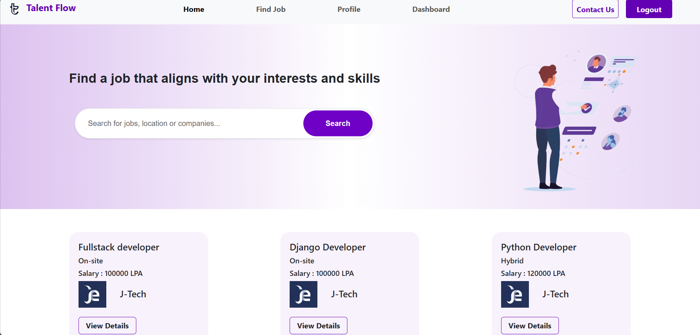
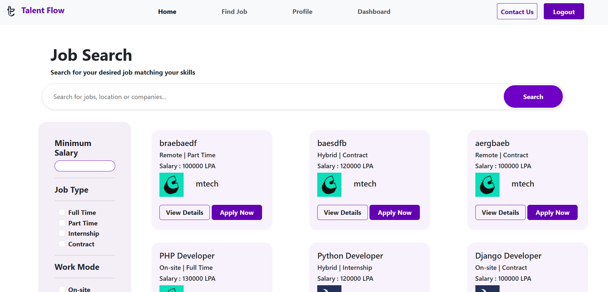
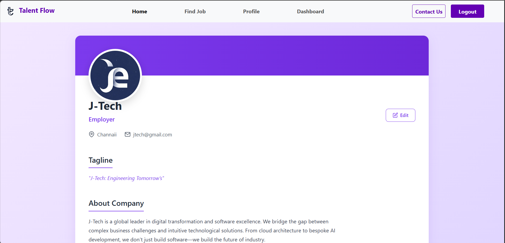
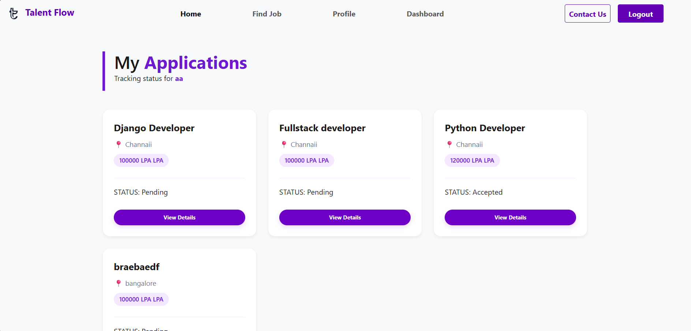
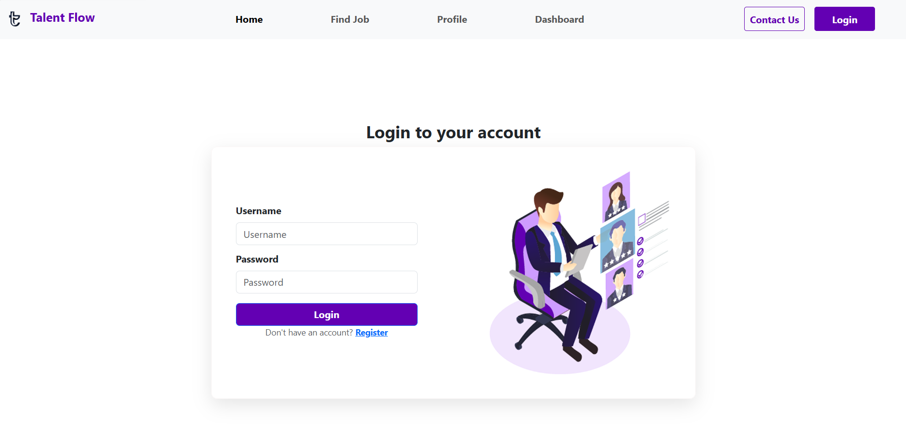
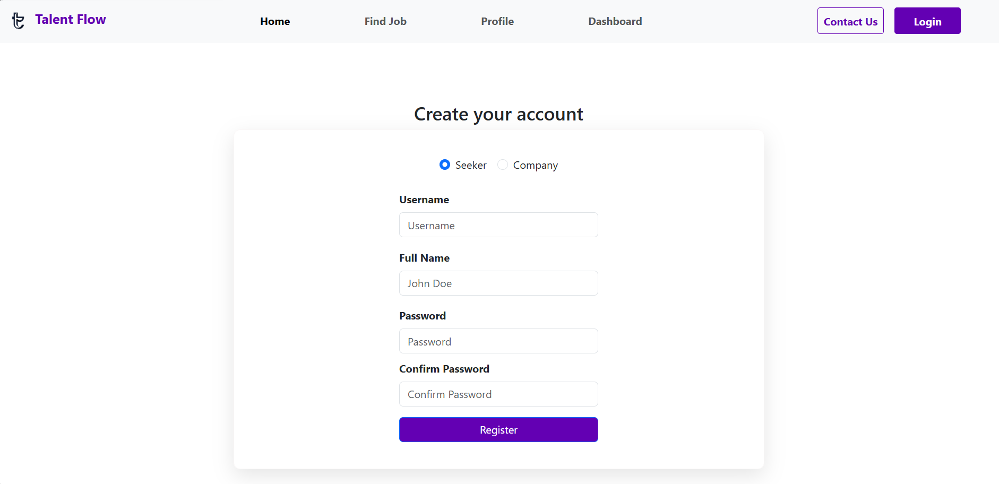

# 🚀 Talent Flow: Advanced 3-Tier Job Portal

[](https://jobportaltalentflow.pythonanywhere.com/)
**Live Demo:** [jobportaltalentflow.pythonanywhere.com](https://jobportaltalentflow.pythonanywhere.com/)

**Talent Flow** is a high-performance recruitment ecosystem developed using **Python** and **Django**. This project bridges the gap between hiring managers and candidates through an intuitive, data-driven workflow, serving as a comprehensive showcase of full-stack web development.

---

## 🏗️ Core Architecture & User Roles
The application implements a strict 3-tier permission model to ensure data security and a clean user experience:

* **🛡️ Administrative Suite:** Managed via the Django Admin Panel for total oversight of users, job categories, and database health.
* **💼 Employer Dashboard:** Features for building company profiles, posting vacancies, and tracking candidate applications.
* **👤 Job Seeker Portal:** Tools for profile building (Skill-mapping), advanced job discovery, and real-time application tracking.

---

## 📸 Project Preview

| 🏠 Homepage | 🔍 Find Jobs |
| :---: | :---: |
|  |  |

| 👤 User Profile | 📊 Employer Dashboard |
| :---: | :---: |
|  |  |

| 🔑 Login Page | 📝 Registration |
| :---: | :---: |
|  |  |

---

## 🌟 Technical Highlights & Logic

### 🧠 Smart Filtering System
* **Dynamic Q-Objects:** Built a flexible search engine that queries across multiple models simultaneously (Job Title, Company Name, and Description).
* **LPA Value Parsing:** Developed backend logic using `Cast` and `Replace` to allow numerical filtering on salary strings, solving the common "text-sorting" issue in databases.
* **Multi-Layered Navigation:** Integrated sidebar filters for **Work Mode** (Remote, On-site, Hybrid) and **Job Type** (Full-time, Internship).

### 📊 Optimized Database Design
* **Relational Integrity:** Utilized `OneToOneField` for user profiles and `ForeignKey` for job-to-company mapping to ensure efficient data retrieval.
* **Redundancy Protection:** Implemented `unique_together` constraints in the Django Models to prevent duplicate applications from the same user for a single job.

### 🎨 Modern UI/UX
* **Bootstrap 5 Framework:** A fully responsive design that ensures a seamless experience across mobile, tablet, and desktop devices.
* **Pagination Logic:** Integrated Django's `Paginator` class to manage large datasets (6 jobs per page), significantly reducing server load and improving page speed.

---

## 🛠️ Technical Stack
* **Language:** Python 3.10+
* **Backend:** Django (ORM, Authentication, Templating, Signals)
* **Frontend:** HTML5, CSS3, JavaScript, Bootstrap 5
* **Data Handling:** SQLite (Development), Pillow (Media/Image processing)

---

## ⚙️ Quick Start Guide

1.  **Clone the Project:**
    ```bash
    git clone [https://github.com/JERIMONSHAJI/Job-Portal-Talen-Flow-.git](https://github.com/JERIMONSHAJI/Job-Portal-Talen-Flow-.git)
    ```
2.  **Setup Environment:**
    ```bash
    python -m venv env
    .\env\Scripts\activate
    ```
3.  **Install Dependencies:**
    ```bash
    pip install -r requirements.txt
    ```
4.  **Initialize Database & Run:**
    ```bash
    python manage.py migrate
    python manage.py runserver
    ```

---

## 👤 Author
**Jerimon Shaji**
*BCA Graduate | Python Django Developer**